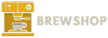

  

<h2>The one stop shop for all of your homebrew needs!</h2>

About the project
=====
There have been various homebrew appstores throughout the years, however none of them quite fit the expectations I wished for. I decided to create one of my own, built to last with a fully featured [package manager](https://github.com/twert627/xbrew), multiple console support, elegance, and the last place you'll ever need to look for homebrew again.

Here's why:
* Your time should be focused on enjoying the homebrew, not the hassle of scouring the web only to find dead links, or it doesn't work
* You shouldn't go expecting quality homebrew and all you find is commercial games and outdated homebrew.
* The appstore shouldn't be complicated, simple to use - and just works.
* It should look good, too many homebrew app stores are just html lists or use a bland css library: Brewshop is built from the ground up, and has been remade several times to ensure it's on par with community standards

Credits
=====
* [twert](https://github.com/twert627) - main developer
* [Epicpkmn11](https://github.com/Epicpkmn11) - writing the app_updater python script
* [Ben Mckeown](https://dribbble.com/shots/1875092-3DS-Homebrew-Launcher-logo) - created the logo
* All homebrew developers

License 
=====
This project uses the GNU GPL v3 license, to see more information about the license, please see [License.md](https://github.com/twert627/BrewShop/blob/master/License.md)